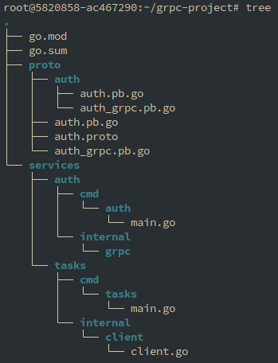
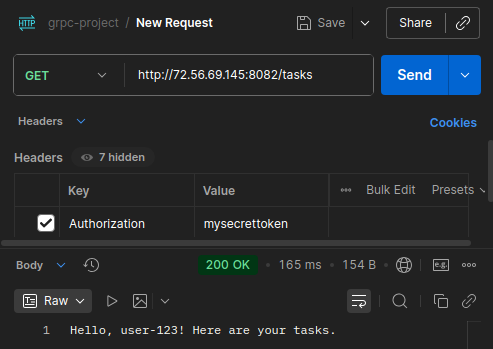
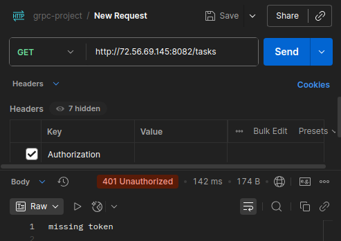
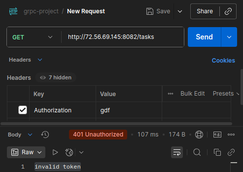
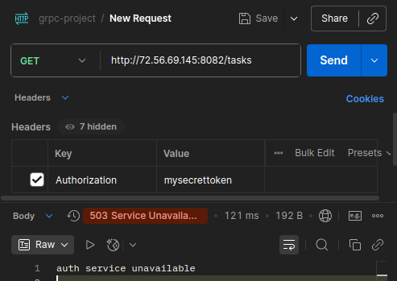
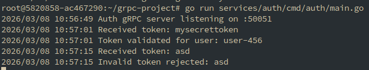
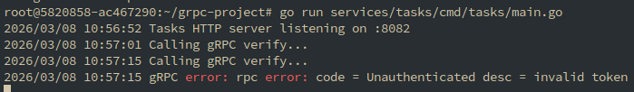

# Практика 2
## Выполнил: Студент ЭФМО-02-25 Пягай Даниил Игоревич
### Структура:

### 1. Описание границ сервисов

**Auth service (gRPC сервер)** — отвечает за аутентификацию и проверку токенов. Реализует gRPC метод Verify, который принимает токен и возвращает информацию о его валидности и субъекте. В учебной реализации содержит фиксированный список валидных токенов:
- `mysecrettoken` → user-456
- `valid_token_123` → user-123
- `admin_token_789` → admin-user
- `test_token_2024` → test-user

**Tasks service (HTTP сервер)** — управляет задачами. Не хранит информацию о пользователях, а перед выполнением каждой операции обращается к Auth service через gRPC клиент для проверки токена. Использует контекст с deadline (2 секунды) для контроля времени ожидания ответа от Auth сервиса.

Границы чётко разделены: Auth занимается только вопросами безопасности, Tasks — только бизнес-логикой работы с задачами. Взаимодействие между сервисами осуществляется через синхронные gRPC вызовы.

### **Описание взаимодействия:**
1. Клиент (Postman) отправляет HTTP запрос на Tasks service с токеном в заголовке Authorization
2. Tasks service через gRPC клиент обращается к Auth service с контекстом и deadline
3. Auth service проверяет токен и возвращает результат (валидность + subject)
4. Tasks service обрабатывает запрос и возвращает ответ клиенту

### 2. Proto контракт

```protobuf
syntax = "proto3";

package auth;

option go_package = "grpc-project/proto/auth";

service AuthService {
  rpc Verify(VerifyRequest) returns (VerifyResponse);
}

message VerifyRequest {
  string token = 1;
}

message VerifyResponse {
  bool valid = 1;
  string subject = 2;
}
```

### 3. Список эндпоинтов

**Auth service (gRPC, порт 50051)**

| Метод gRPC | Запрос | Ответ | Описание |
|------------|--------|--------|----------|
| Verify | VerifyRequest (token) | VerifyResponse (valid, subject) | Проверка валидности токена |

**Tasks service (HTTP, порт 8082)**

| Метод | Путь | Описание | Требуемый заголовок |
|-------|------|----------|---------------------|
| GET | /tasks | Получение задач | Authorization: \<token\> |

### 4. Проверка запросов POSTMAN

Запрос №1: Успешная авторизация (токен есть)



Запрос №2: Без токена (ошибка)



Запрос №3: Неправильный токен



Запрос №4: Auth сервис недоступен




### 5. Логи



